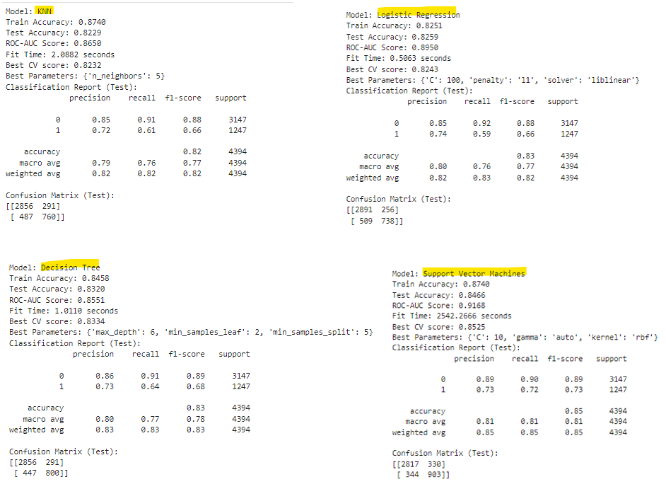
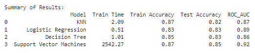
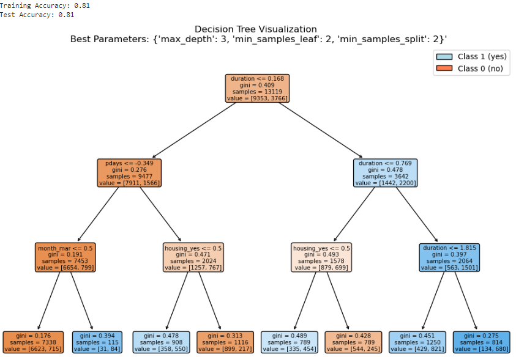
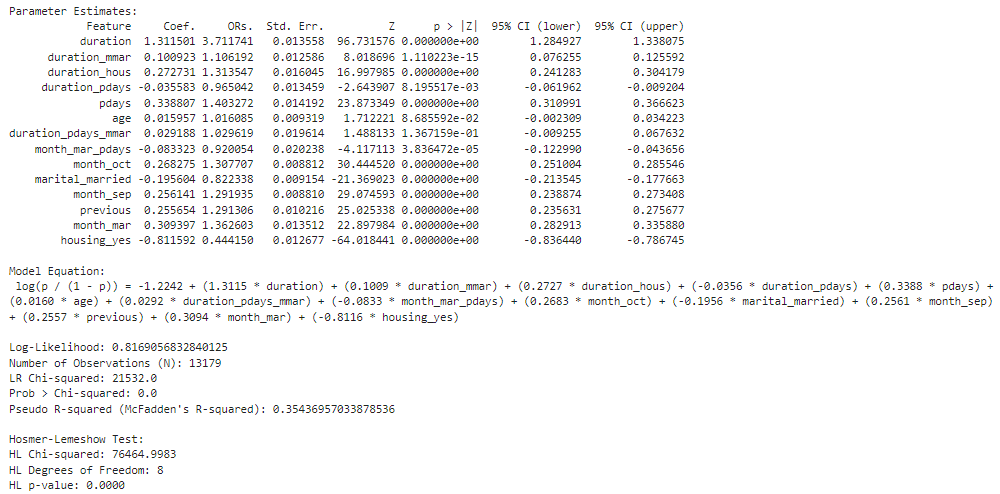
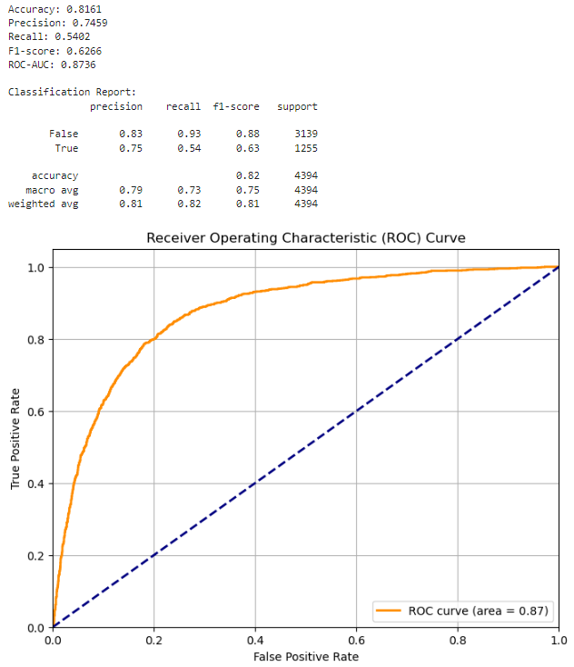
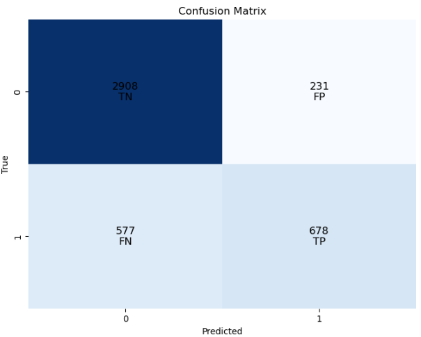

### Comparative Analysis of Machine Learning Models for Predicting Term Deposit Subscriptions

**Introduction:**
In the competitive banking sector, optimizing marketing strategies is crucial for enhancing profitability and customer engagement. This study evaluated data from a Portuguese bank’s direct marketing campaigns, where phone calls were used to promote term deposits. The goal was to analyze client interactions and campaign outcomes to refine marketing efforts and boost term deposit subscriptions.

We compared four classification models—Logistic Regression (LR), Decision Trees (DT), K-Nearest Neighbors (KNN), and Support Vector Machines (SVM)—to determine which model best predicted term deposit subscriptions. The comparison focused on accuracy, training speed, and ROC-AUC score.

**Objectives:**
Compare LR, DT, KNN, and SVM models based on accuracy, training time, and ROC-AUC score to identify the most effective model for predicting term deposit subscriptions.

**Models Analyzed**

* **Logistic Regression (LR)**
  * **Pros:** Easily interpretable, quick to train, handles imbalanced classes well.
  * **Cons:** May struggle with complex, non-linear patterns without additional feature engineering.
<br>

* **Decision Trees (DT)**
  * **Pros:** Easy to visualize and interpret, can be pruned to manage performance on minority classes, fast training.
  * **Cons:** Risk of overfitting and creating overly complex trees.
<br>

* **K-Nearest Neighbors (KNN)**
  * **Pros:** Simple and easy to implement, effective with imbalanced classes if proper distance metrics and weighting are used.
  * **Cons:** Slow prediction times with large datasets, less interpretable than other models.
<br>

* **Support Vector Machines (SVM)**
  * **Pros:** Effective in high-dimensional spaces, handles class imbalance with appropriate kernels, performs well with complex, non-linear tasks.
  * **Cons:** Computationally intensive and slower with large datasets, harder to interpret due to high-dimensional transformations.<br>
<br>

**Methodology**

**Data Understanding**
* **Data Source:** The dataset `bank-additional-full.csv` from the UCI Machine Learning Repository (ID: 222) includes client demographics, banking information, contact details, and historical campaign data (N = 45,211).
* **Feature and Target Variables:** The dataset was split into features (X) and target labels (y), and then into training and test sets using Python’s `train_test_split`.

  **Variable Description:**
  ```
  Feature Variables:
  1 - age (numeric)
  2 - job (categorical: 'admin.','blue-collar', etc.)
  3 - marital (categorical: 'divorced','married', etc.)
  4 - education (categorical: 'basic.4y','high.school', etc.)
  5 - default (binary: 'no','yes')
  6 - balance (numeric)
  7 - housing (binary: 'no','yes')
  8 - loan (binary: 'no','yes')
  9 - contact (categorical: 'cellular','telephone')
  10 - month (categorical: 'jan', 'feb', etc.)
  11 - day_of_week (categorical: 'mon','tue', etc.) [renamed to; day_of_month] 
  12 - duration (numeric)
  13 - campaign (numeric)
  14 - pdays (numeric; 999 means not previously contacted)
  15 - previous (numeric)
  16 - poutcome (categorical: 'failure','nonexistent','success')
   
  Target Variable:
  17 - y (binary: 'yes','no')
  ```


**Data Preparation and Feature Engineering**

* **Transformations:** Numeric features were standardized or normalized, while categorical features were one-hot encoded. For interpretability, features were reverted to their original scale in the final model. To address class imbalance (5,289 `y='yes'` records vs. 39,922 `y='no'` records), a Case-Control study design was implemented. This involved sampling one record where `y='yes'` for every three records where `y='no'`, resulting in a less sparse dataset of 5,289/21,156 records.

* **Data Cleaning:** Features with high missingness rates, specifically `contact` (26%) and `poutcome` (79.10%), were removed. To ensure the completeness required for statistical modeling, observations with missing values were excluded through listwise deletion. After encoding categorical features, addressing missing values and duplicates, the final dataset comprised 5,021 `y='yes'` records out of N = 17,493 and 35 features.

```
List of columns in the DataFrame:
['age', 'balance', 'day_of_month', 'duration', 'campaign', 'pdays', 'previous', 'job_blue-collar', 'job_entrepreneur', 'job_housemaid', 'job_management', 'job_retired', 'job_self-employed', 'job_services', 'job_student', 'job_technician', 'job_unemployed', 'marital_married', 'marital_single', 'education_secondary', 'education_tertiary', 'default_yes', 'housing_yes', 'loan_yes', 'month_aug', 'month_dec', 'month_feb', 'month_jan', 'month_jul', 'month_jun', 'month_mar', 'month_may', 'month_nov', 'month_oct', 'month_sep']

Shape of preprocessed X: (17493, 35)
Shape of y data: (17493,)
```

* **Interactions and Higher-Order Terms:** Decision Tree was used  to identify important complex interaction features. Higher-order terms were not investigated due to computational and time constraints.

**Model Training and Evaluation**

* **Hyperparameter Tuning:** Explored the following parameter grids:
  * **KNN:** `n_neighbors` values of 3, 5, 7.
  * **Logistic Regression:** `C` values of 0.001, 0.01, 0.1, 1, 10, 100; `Penalty`: l1, l2, none and `Solver`: liblinear.
  * **Decision Tree:** `max_depth` values of None,2, 3, 4, 5, 6,  10, 20; `min_samples_split` values of 2, 5; `min_samples_leaf` values of 1, 2.
  * **SVM:** `C` values of 0.001, 0.01, 0.1, 1, 10, 100; `kernel`: linear, rbf; and `gamma` values of scale, auto, 0.001, 0.01, 0.1, 1, 10.

  Used GridSearchCV with 5-fold cross-validation to optimize hyperparameters and measured training duration with Python’s `time.time()` function.

* **Predictions and Performance Metrics:**
  * **Prediction Scores:** Computed for training and test sets.
  * **Accuracy Scores:** Evaluated for training and test datasets.
  * **Classification Report:** Detailed precision, recall, and F1-score for test sets.
  * **Confusion Matrix:** Visualized model performance.
  * **ROC-AUC Score:** Assessed performance on imbalanced classes.

The final selected model was analyzed to interpret predictors of term deposit subscriptions.

**Results**





**Model Evaluation** <br>
**1. Support Vector Machines (SVM):**
* **Strengths:** Highest ROC-AUC score (0.92), indicated the best ability to discriminate between classes (subscribers vs. non-subscribers). High test accuracy (0.85) and balanced performance across classes.
* **Weaknesses:** Very high training time (2542.27 seconds), which could be impractical for large datasets or frequent retraining.

**2. K-Nearest Neighbors (KNN):**<br>
* **Strengths:** Good ROC-AUC score (0.87) and reasonable test accuracy (0.82). Decent balance between precision and recall, with relatively shorter training time (2.09 seconds).
* **Weaknesses:** Lower test accuracy compared to SVM and slightly less effective in handling class imbalance (lower recall for the subscribers class).

**3. Logistic Regression:**<br>
* **Strengths:** Competitive ROC-AUC score (0.89) and test accuracy (0.83). Moderate training time (0.51 seconds) and simple interpretability.
* **Weaknesses:** Slightly lower performance in ROC-AUC compared to SVM, with similar issues in recall for the subscribers class.

**4. Decision Tree:**<br>
* **Strengths:** Reasonable ROC-AUC score (0.86) and test accuracy (0.83). Moderate training time (1.01 seconds).
* **Weaknesses:** Lower ROC-AUC compared to SVM and Logistic Regression. The model can also be prone to overfitting, especially if not tuned properly.

**Best Model Choice:**<br>
Support Vector Machines (SVM) was the best model overall based on the following considerations:

* **ROC-AUC Score:** Highest, which indicated the best performance in distinguishing between classes.
* **Test Accuracy:** High at 0.85, reflecting overall good performance.
* **Class Balance:** SVM has balanced precision and recall for both classes, showing robust performance across the board.

**Trade-offs:**<br>
* **Training Time:** SVM has a significantly longer training time compared to the other models. This is a critical factor if the model needs to be retrained frequently or in case of large datasets.
* **Complexity:** SVMs are more complex to tune and interpret compared to simpler models like Logistic Regression or Decision Trees.

**Conclusion:**<br>
SVM was the best choice, however, for faster training times, interpretability and reasonable performance, Logistic Regression was more practical hence selected. 


**FINAL MODEL: LOGISTIC REGRESSION**<br>
A decision tree algorithm was used to explore complex interactions to add to the logistic regression model.



The interaction patterns below where derived and added to the Logistic regression model:
```
  1. duration x pdays
  2. duration x month_mar
  3. month_mar x pdays
  4. duration x pdays x month_mar
  5. duration x housing_yes
```
All interaction patterns were statistically significant except `duration x pdays x month_mar (duration_pdays_mmar)`.


**Final Model**







**Interpretation**

***Coefficients & Odds Ratios:***<br>
* **Duration:** A one-unit increase in last contact duration was associated with a 3.71-fold increase in the odds of subscription to a term deposit.<br>
* **Housing:** Having a housing loan decreased the odds of subscribing to a term deposit by 56%.<br>
  
**Statistical Significance:**
All features were statistically significant (p < 0.05) except age and interaction of duration_pdays_mmar, which have p-values slightly above 0.05.

**Model Fit:**
* **LR Chi-squared** was very high, and the p-value indicated a significant model fit compared to a null model. The Pseudo R-squared (McFadden’s) of 0.354 suggested that the model explained approximately 35.4% of the variance in the target variable.

* **Hosmer-Lemeshow Test:** The high Chi-squared value and the low p-value indicated that there might be issues with the goodness-of-fit of the model. The model did not fit the data perfectly. 

**Overall Summary**<br>
* **Strengths:** The model showed good overall performance with a high ROC-AUC score (87.4%), indicating strong discriminative ability. Precision for the non-subscribers class was high, which is good for identifying non-subscribers accurately.<br>
* **Weaknesses:** The recall for the subscribers class was lower, meaning the model missed a considerable proportion of actual subscribers. This may be important if the goal is to identify as many subscribers as possible, even if it means accepting some false positives.

**Conclusion**
The model can be adjusted through further feature engineering; including new or previously dropped features or excluding specific features, balancing the classes and/or more hyperparameters tuning in order to improve the model fittness and performance.


